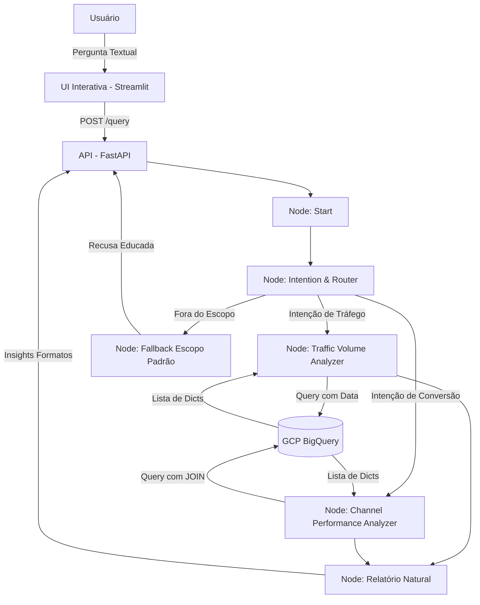

# Design Técnico e Arquitetura do MVP

## Visão Geral
Este documento descreve as decisões arquiteturais para a implementação do Agente de IA responsável pela análise de tráfego do *thelook_ecommerce*. O foco principal é demonstrar **senioridade na organização do código e integração entre a inteligência do fluxo e a camada de banco de dados**, garantindo respostas baseadas em dados concretos (RAG via chamadas de funções direcionadas) sem complexidade acidental.

## 1. Arquitetura e Fluxo do LangGraph

Utilizaremos o **LangGraph** por oferecer suporte robusto a fluxos baseados em *State Management* (grafos direcionados), que permite separar de forma mais inteligente a interpretação de texto e as execuções restritas em Python.



## 2. Modelos de Condução e API (Pydantic)

Uso forte de `Pydantic` nos Tools permite que o modelo faça o binding de argumentos formatados no JSON schema.

```python
from pydantic import BaseModel, Field
from datetime import date
from typing import Optional, List

# --- Contratos das Ferramentas (Input) ---
class TrafficVolumeInput(BaseModel):
    traffic_source: Optional[str] = Field(None, description="Filtre pela origem ex: Search, Organic, Facebook.")
    start_date: date = Field(..., description="Data de início (YYYY-MM-DD).")
    end_date: date = Field(..., description="Data de fim (YYYY-MM-DD).")

class ChannelPerformanceInput(BaseModel):
    traffic_source: Optional[str] = Field(None, description="Origem a analisar.")
    start_date: date = Field(..., description="Data de início da avaliação.")
    end_date: date = Field(..., description="Data limite da avaliação.")

# --- Contratos da API FastAPI ---
class QueryRequest(BaseModel):
    question: str = Field(..., max_length=1000)

class QueryResponse(BaseModel):
    answer: str
    tools_used: List[str]
```

## 3. Padrões de Queries SQL (BigQuery)

Para as duas ferramentas, a interface com o BigQuery Client utilizará **Parameterized Queries** para evitar injeções e falhas na string formatting. Abaixo as estruturas lógicas projetadas:

### 3.1. Query para Tool A (Volume de Tráfego)
```sql
SELECT 
    traffic_source,
    COUNT(DISTINCT id) as user_count
FROM `bigquery-public-data.thelook_ecommerce.users`
WHERE created_at BETWEEN @start_date AND @end_date
  AND (@traffic_source IS NULL OR traffic_source = @traffic_source)
GROUP BY traffic_source
ORDER BY user_count DESC;
```

### 3.2. Query para Tool B (Performance Financeira de Canais)
```sql
SELECT 
    u.traffic_source,
    COUNT(DISTINCT o.order_id) as total_orders,
    SUM(oi.sale_price) as total_revenue
FROM `bigquery-public-data.thelook_ecommerce.users` u
-- O LEFT JOIN prevê contas que não necessariamente converteram nada
LEFT JOIN `bigquery-public-data.thelook_ecommerce.orders` o ON u.id = o.user_id
INNER JOIN `bigquery-public-data.thelook_ecommerce.order_items` oi ON o.order_id = oi.order_id
WHERE o.created_at BETWEEN @start_date AND @end_date
  AND (@traffic_source IS NULL OR u.traffic_source = @traffic_source)
GROUP BY u.traffic_source
ORDER BY total_revenue DESC
LIMIT 10;
```

## 4. Gestão de Estado e Exceções (Fallback)

1. **Restrições de LLM:** O nó root deve passar uma `SystemMessage` com base limitando o bot: *"Você é um Analista Júnior restrito a tabelas do E-Commerce thelook. Nunca discuta código, política ou gere dados sem suas tools."*
2. **BigQuery Fallbacks:** Qualquer `GoogleAPIError` não capturada de banco deve retornar algo tratável, como: `{"error": "Falha de comunicação temporária com o GCP."}` para não quebrar o Agent.
3. **Erros de Parse:** Em caso da LLM retornar datas incorretas, a Tool deve emitir erro validado pelo Pydantic de volta para a LLM reajustar (Feature nativa do LangGraph).
