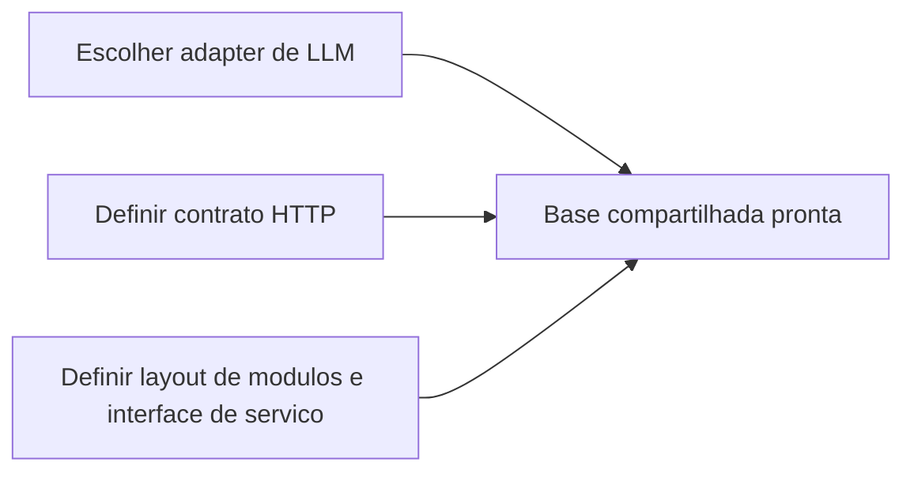
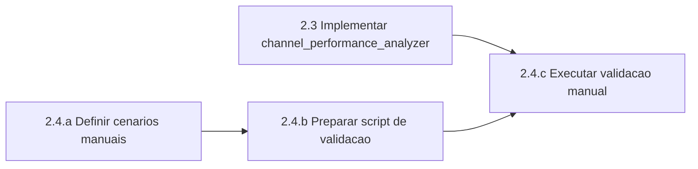
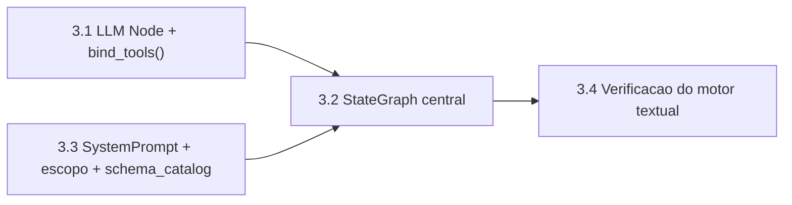
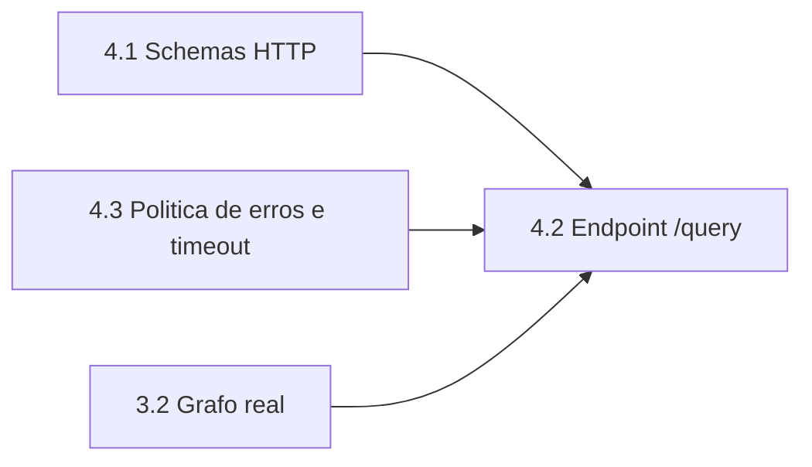
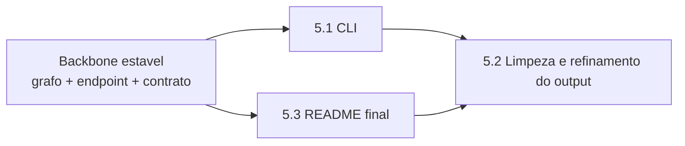
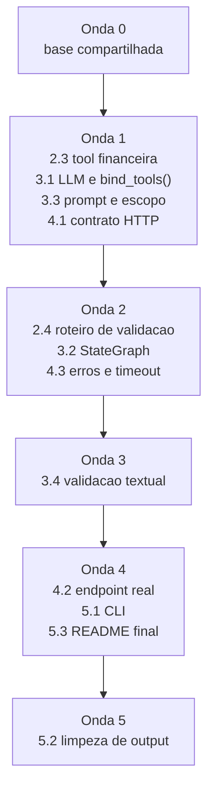

# Analise Minuciosa de Paralelismo do MVP

Este documento detalha as tarefas pendentes do MVP em subtarefas menores e identifica onde faz sentido usar worktrees e agentes em paralelo.

O foco aqui nao e o fluxo funcional do produto. O foco e o fluxo de execucao do trabalho.

## 0. Base compartilhada antes do paralelismo pesado

Antes de dividir o trabalho, existe um bloco pequeno que reduz quase todos os conflitos posteriores.

| Bloco | Subtarefas internas | Pode rodar em paralelo? | Motivo |
| --- | --- | --- | --- |
| Dependencia de LLM | escolher adapter, adicionar dependencia, travar versao | Nao | toca `pyproject.toml`, que conflita cedo |
| Contrato HTTP | definir `QueryRequest`, `QueryResponse`, `metadata/tools_used` | Sim, com estrutura de pastas | baixo acoplamento com SQL |
| Layout de modulos | decidir `app/graph/*`, `app/routers/*`, `app/services/*` | Nao | evita que cada branch invente um layout diferente |
| Contrato de servico | definir interface unica de consulta | Nao | API, CLI e grafo dependem disso |

Leitura: esse bloco e curto, mas vale centralizar antes de abrir varias frentes.

## 1. Fase 2: Tools Analytics

Status atual:

- `2.1` concluida
- `2.2` concluida
- `2.3` pendente
- `2.4` pendente

### 1.1 Quebrando a task 2.3

| Subtarefa | Descricao | Pode virar worktree proprio? | Dependencias | Arquivos mais provaveis |
| --- | --- | --- | --- | --- |
| `2.3.a` | fechar semantica da query: coluna de data, `JOIN`, `COUNT(DISTINCT)`, `SUM(sale_price)`, `NULL/Unknown` | Nao | nenhuma | `app/tools/channel_performance_analyzer.py` |
| `2.3.b` | escrever SQL parametrizada | Nao | `2.3.a` | `app/tools/channel_performance_analyzer.py` |
| `2.3.c` | mapear rows para `ChannelPerformanceOutput` | Nao | `2.3.b` | `app/tools/channel_performance_analyzer.py` |
| `2.3.d` | exportar a tool no pacote | Nao | `2.3.c` | `app/tools/__init__.py` |

Analise:

- `2.3.a` ate `2.3.d` formam um mesmo miolo de implementacao.
- Nao vale dividir essa task entre dois agentes, porque quase tudo toca os mesmos arquivos.
- O melhor uso de paralelismo aqui e deixar um agente dono da tool inteira enquanto outra frente trabalha fora de `app/tools/`.

### 1.2 Quebrando a task 2.4

| Subtarefa | Descricao | Pode rodar em paralelo com `2.3`? | Dependencias | Arquivos provaveis |
| --- | --- | --- | --- | --- |
| `2.4.a` | definir cenarios manuais de teste | Sim | nenhuma | `scripts/*` ou notas temporarias |
| `2.4.b` | criar script simples para chamar as duas tools | Parcialmente | contrato da tool precisa existir | `scripts/*` |
| `2.4.c` | executar cenarios no terminal e conferir resultados | Nao | `2.3` pronta | `scripts/*` |
| `2.4.d` | registrar observacoes para README/checklist | Sim, no fim | `2.4.c` | `README.md` |

Analise:

- A unica parte realmente paralelizavel de `2.4` e o desenho dos cenarios e do script.
- A execucao manual em si depende da tool pronta.
- Portanto, o paralelismo bom aqui e:

### 1.3 Oportunidade pratica de worktrees na Fase 2

| Worktree | Ownership | Nao deveria tocar |
| --- | --- | --- |
| `wt/data-tool` | `app/tools/channel_performance_analyzer.py`, `app/tools/__init__.py` | `app/graph/*`, `app/main.py` |
| `wt/manual-validation` | `scripts/*`, checklist de cenarios | `app/tools/channel_performance_analyzer.py` enquanto a implementacao estiver aberta |

## 2. Fase 3: Orquestracao em Grafo

Status atual:

- `3.1` pendente
- `3.2` pendente
- `3.3` parcialmente adiantada por causa de `app/schema_catalog.py`, mas ainda pendente
- `3.4` pendente

### 2.1 Regra de leitura para esta fase

Nesta correcao, cada item `3.1`, `3.2`, `3.3` e `3.4` e tratado como indivisivel.

### 2.2 Matriz de paralelismo entre 3.1, 3.2, 3.3 e 3.4

| Item | Pode rodar em paralelo com | Nao deveria rodar em paralelo com | Motivo |
| --- | --- | --- | --- |
| `3.1` | `3.3` | `3.2`, `3.4` | `3.1` prepara LLM e `bind_tools()`, enquanto `3.3` define prompt e politica; os dois convergem no grafo |
| `3.2` | nenhum dos outros como bloco inteiro | `3.1`, `3.3`, `3.4` | `3.2` depende do LLM ligado e das regras de prompt/roteamento estarem definidas |
| `3.3` | `3.1` | `3.2`, `3.4` | `3.3` e uma frente de prompt e escopo relativamente independente do wiring tecnico inicial |
| `3.4` | nenhum dos outros como bloco inteiro | `3.1`, `3.2`, `3.3` | `3.4` e validacao do motor textual sobre o fluxo montado; como item inteiro, faz mais sentido depois do grafo pronto |

### 2.3 Leitura pratica

- `3.1` e `3.3` podem ser executados em paralelo.
- `3.2` deve comecar depois que `3.1` e `3.3` estiverem suficientemente fechados.
- `3.4` deve ficar por ultimo dentro da Fase 3.

Em outras palavras, a Fase 3 fica assim:

### 2.4 Oportunidade pratica de worktrees na Fase 3

| Worktree | Ownership | Nao deveria tocar |
| --- | --- | --- |
| `wt/phase3-llm-binding` | o bloco inteiro de `3.1` | `app/prompts/*`, `README.md` |
| `wt/phase3-prompt-scope` | o bloco inteiro de `3.3` | `app/graph/*` principal |
| `wt/phase3-graph-core` | o bloco inteiro de `3.2` | `README.md`, `app/main.py` enquanto o grafo estiver em construcao |

Observacao:

- eu nao abriria um worktree separado para `3.4` antes de `3.2` terminar.
- se voce quiser paralelismo seguro dentro da Fase 3, a divisao boa e `3.1` em uma frente e `3.3` em outra.

## 3. Fase 4: API

Status atual:

- `4.1` pendente
- `4.2` pendente
- `4.3` pendente

### 3.1 Quebrando a task 4.1

| Subtarefa | Descricao | Paralelizavel? | Dependencias | Arquivos provaveis |
| --- | --- | --- | --- | --- |
| `4.1.a` | definir `QueryRequest` | Sim | contrato base | `app/schemas/api.py` |
| `4.1.b` | definir `QueryResponse` | Sim | contrato base | `app/schemas/api.py` |
| `4.1.c` | fechar estrutura de `metadata` e `tools_used` | Nao | `4.1.a`, `4.1.b` | `app/schemas/api.py` |

Analise:

- `4.1.a` e `4.1.b` podem ser pensadas em paralelo, mas na pratica costumam cair no mesmo arquivo.
- Ainda assim, essa task e boa para uma frente separada da implementacao do grafo.

### 3.2 Quebrando a task 4.3

| Subtarefa | Descricao | Paralelizavel? | Dependencias | Arquivos provaveis |
| --- | --- | --- | --- | --- |
| `4.3.a` | mapear erros de dominio, BigQuery e timeout | Sim | nenhuma | `app/main.py`, `app/routers/*` |
| `4.3.b` | implementar handler ou camada de traducao | Sim, com `4.1` | `4.3.a` | `app/main.py`, `app/routers/*` |

Analise:

- `4.3` pode avancar antes do grafo final, desde que exista um contrato minimo de resposta/erro.
- Isso permite deixar a API preparada para ligar o servico real depois.

### 3.3 Quebrando a task 4.2

| Subtarefa | Descricao | Paralelizavel? | Dependencias | Arquivos provaveis |
| --- | --- | --- | --- | --- |
| `4.2.a` | criar router `/query` com stub de servico | Parcialmente | `4.1` | `app/routers/query.py` |
| `4.2.b` | ligar o grafo real no endpoint | Nao | `3.2`, `4.3` | `app/routers/query.py`, `app/main.py` |
| `4.2.c` | serializar `answer`, `tools_used`, `metadata` | Nao | `4.2.a` | `app/routers/query.py` |

Analise:

- O melhor paralelismo aqui e separar a superficie HTTP da implementacao real do grafo.
- Ou seja: primeiro um endpoint com contrato estavel e stub; depois a injecao do backend real.

### 3.4 Oportunidade pratica de worktrees na Fase 4

| Worktree | Ownership | Nao deveria tocar |
| --- | --- | --- |
| `wt/api-contract` | `app/schemas/api.py`, `app/routers/*` | `app/tools/*` |
| `wt/api-errors` | handlers e traducao de excecao | `app/graph/*` |

Observacao:

- se `app/main.py` continuar sendo o unico ponto de wiring, ele vira hotspot de conflito.
- a melhor mitigacao e criar cedo `app/routers/query.py` e deixar `app/main.py` o mais fino possivel.

## 4. Fase 5: CLI e apresentacao

Status atual:

- `5.1` pendente
- `5.2` pendente
- `5.3` pendente

### 4.1 Quebrando a task 5.1

| Subtarefa | Descricao | Paralelizavel? | Dependencias | Arquivos provaveis |
| --- | --- | --- | --- | --- |
| `5.1.a` | escolher entrypoint do CLI | Sim | contrato de servico | `app/cli.py` ou `scripts/ask_analyst.py` |
| `5.1.b` | coletar pergunta e enviar ao servico | Nao | `4.2` ou contrato local | `app/cli.py` |
| `5.1.c` | imprimir resposta final | Nao | `5.1.b` | `app/cli.py` |

### 4.2 Quebrando a task 5.3

| Subtarefa | Descricao | Paralelizavel? | Dependencias | Arquivos provaveis |
| --- | --- | --- | --- | --- |
| `5.3.a` | setup de ambiente e credenciais | Sim | nenhuma | `README.md` |
| `5.3.b` | instrucoes de API e CLI | Parcialmente | `4.2`, `5.1` | `README.md` |
| `5.3.c` | diagrama final da arquitetura | Parcialmente | `3.2`, `4.2` | `README.md` |

### 4.3 Quebrando a task 5.2

| Subtarefa | Descricao | Paralelizavel? | Dependencias | Arquivos provaveis |
| --- | --- | --- | --- | --- |
| `5.2.a` | checar formatacao Pt-BR de numeros | Nao | saida real | `app/cli.py`, prompts |
| `5.2.b` | revisar clareza do insight | Nao | sintese real | prompts, grafo, CLI |
| `5.2.c` | alinhar output entre CLI e API | Nao | `5.1`, `4.2` | CLI e API |

Analise:

- `5.1` e `5.3` podem andar em paralelo quando o contrato de resposta estiver estavel.
- `5.2` e uma camada tardia de refinamento; nao vale antecipar cedo.

### 4.4 Oportunidade pratica de worktrees na Fase 5

| Worktree | Ownership | Nao deveria tocar |
| --- | --- | --- |
| `wt/cli` | `app/cli.py` ou `scripts/ask_analyst.py` | `app/graph/*` |
| `wt/docs` | `README.md` | `app/tools/*`, `app/graph/*` |

## 5. Comparativo por fase: onde vale ou nao vale paralelizar

| Fase | Partes que valem paralelismo | Partes que nao valem dividir | Motivo principal |
| --- | --- | --- | --- |
| Fase 2 | `2.3` versus desenho de `2.4`; implementacao da tool versus script de validacao | subtarefas internas de `2.3` | tudo toca a mesma tool |
| Fase 3 | `3.1` com `3.3` | `3.2` com qualquer outro bloco; `3.4` cedo demais | `3.2` e o ponto de convergencia, e `3.4` valida o fluxo montado |
| Fase 4 | `4.1` e `4.3`, com `4.2.a` stubado | `4.2.b` injecao real do grafo | wiring final concentra dependencia |
| Fase 5 | `5.1` e `5.3` depois do backbone | `5.2` cedo demais | depende de output real |

## 6. Ondas recomendadas de execucao

Leitura:

- A onda 1 e a melhor janela de paralelismo forte.
- A onda 3 e mais serial por natureza.
- A onda 4 volta a abrir espaco para multiplos agentes.

## 7. Hotspots de conflito entre worktrees

| Arquivo ou area | Risco | Como reduzir |
| --- | --- | --- |
| `pyproject.toml` | alto | mexer uma vez, no inicio |
| `app/main.py` | alto | extrair routers cedo |
| `app/tools/__init__.py` | medio | atualizar so quando a tool estiver pronta |
| `README.md` | medio | deixar para a onda final |
| `app/graph/*` | alto | manter ownership unico |

## 8. Recomendacao objetiva de agentes paralelos

| Agente | Escopo ideal | Momento |
| --- | --- | --- |
| Agente 1 | tool financeira `2.3` | onda 1 |
| Agente 2 | bloco inteiro `3.1` | onda 1 |
| Agente 3 | bloco inteiro `3.3` | onda 1 |
| Agente 4 | contrato HTTP e estrutura base da API `4.1` | onda 1 |
| Agente 5 | CLI ou README final | onda 4 |

Restricao importante:

- nao vale abrir dois agentes simultaneos para o mesmo bloco da Fase 3
- nao vale quebrar `channel_performance_analyzer.py` entre varios agentes
- nao vale adiantar `3.4` antes de `3.2`
- nao vale adiantar `5.2` antes de existir output real para comparar
