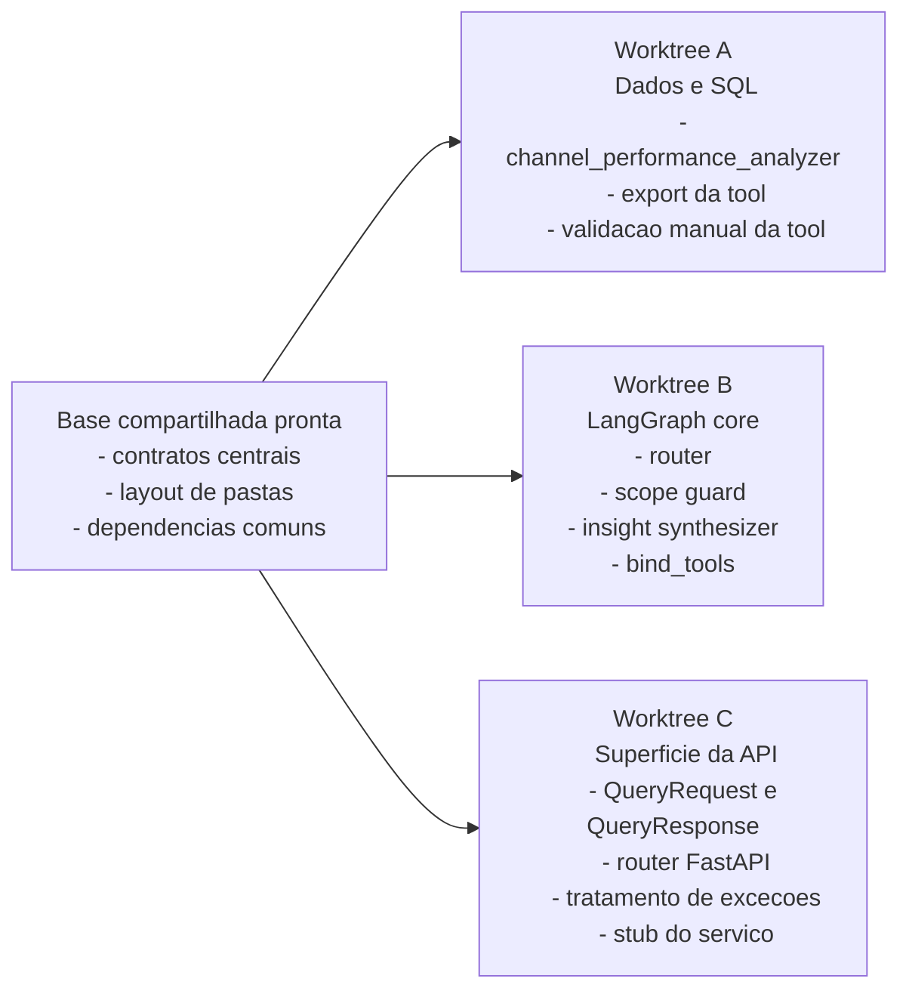
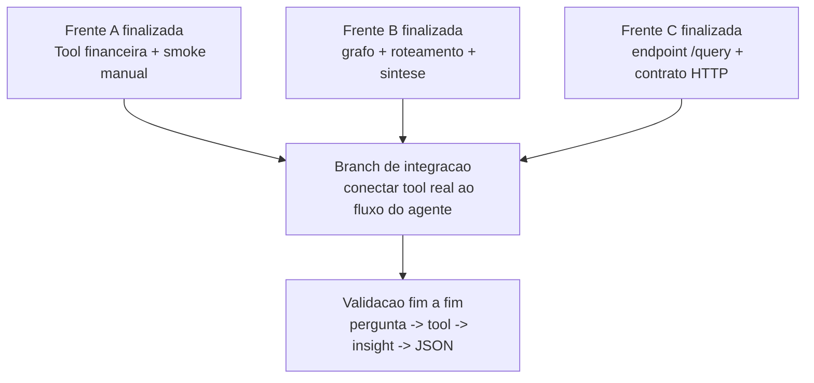
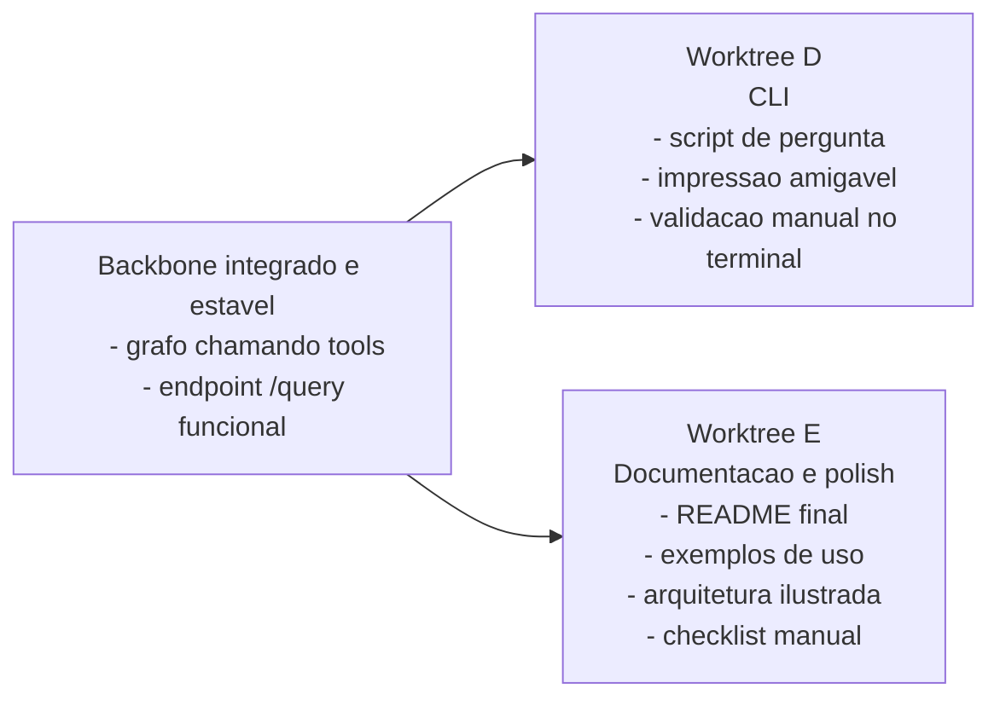
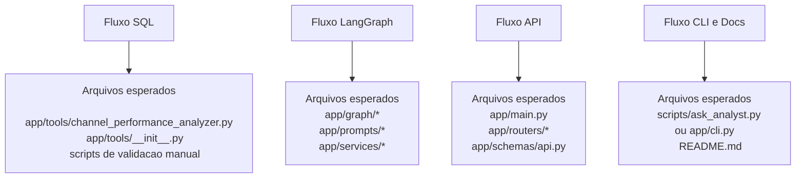

# Fluxos Paralelizaveis do MVP

Este documento mostra apenas frentes que podem ser executadas em paralelo com worktrees e agentes. Etapas puramente seriais nao aparecem aqui.

## 1. Paralelismo inicial apos a base compartilhada

Leitura: depois que a base compartilhada estiver mergeada, essas tres frentes podem avancar em paralelo com baixo acoplamento inicial.

## 2. Integracao das frentes independentes

Leitura: A, B e C podem andar em paralelo, mas convergem na integracao final, onde o endpoint passa a chamar o grafo real com a nova tool conectada.

## 3. Paralelismo tardio apos o backbone estar estavel

Leitura: quando o contrato de resposta ja estiver estabilizado, CLI e documentacao podem ser tocados em paralelo sem disputar o nucleo do sistema.

## 4. Regra pratica de ownership por fluxo

Leitura: esse recorte reduz conflito porque cada worktree tem ownership predominante sobre um conjunto pequeno de arquivos.
