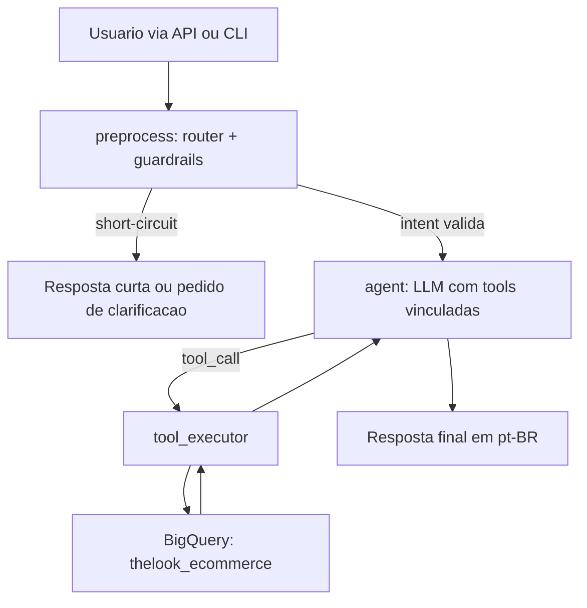

# Media Traffic AI Analyst

Agente de analytics para Midia e Growth que entende perguntas em linguagem natural, consulta o dataset real `bigquery-public-data.thelook_ecommerce` no BigQuery via tool calling e responde em linguagem natural com leitura de negocio.

Este README foi escrito para o avaliador do desafio. O foco aqui e deixar a correcao objetiva: o que foi implementado, onde isso esta no codigo e como validar rapidamente.

## 1. Resumo para o avaliador

O MVP entregue cobre o fluxo principal pedido no case:

- recebe perguntas sobre trafego, pedidos e receita por canal;
- usa `FastAPI` como superficie HTTP e `LangGraph` como orquestrador;
- usa `tool calling` real, com tools Python separadas do prompt;
- consulta o dataset publico `thelook_ecommerce` via cliente oficial do BigQuery;
- responde em linguagem natural, em pt-BR, com interpretacao para Midia e Growth;
- oferece continuidade multi-turn via `thread_id` com persistencia em memoria (`MemorySaver`);
- expande o fluxo para clarificacoes, recusas de fora de escopo e follow-ups estrategicos/diagnosticos.

Superficies publicas desta entrega:

- API FastAPI com `GET /health` e `POST /query`
- CLI conversacional `analyst-chat`, consumindo a API local
- `thread_id` opcional para continuidade multi-turn em memoria
- header `X-Debug` opcional para inspecao tecnica do roteamento e das tool calls

Escopo atual do MVP:

- volume de usuarios por canal;
- total de pedidos por canal;
- total de receita por canal;
- comparacao/ranking entre canais;
- follow-ups estrategicos e diagnosticos baseados em uma analise anterior valida do mesmo `thread_id`.

Formatos temporais suportados no roteamento:

- `YYYY-MM-DD`
- `DD/MM/AAAA`
- `DD/MM/AA`
- `ontem`, `este mes`, `ultimo mes`, `ultimos N dias`

Limitacoes intencionais desta fase:

- sem persistencia duravel entre reinicios do processo;
- sem metricas fora do schema atual, como ROAS, CAC, CTR, CPC, CPM, campanhas, anuncios ou criativos;
- dataset limitado a `users`, `orders` e `order_items`;
- filtro direto por um unico `traffic_source` por tool call; comparacoes entre canais usam consulta agregada e sintese final.

## 2. Mapa rapido de correcao

| Criterio do case | Como checar rapido | Arquivos principais |
| --- | --- | --- |
| Arquitetura do Agente | Leia `app/graph/workflow.py`, `app/graph/tools.py` e rode uma pergunta valida com `X-Debug: true` | `app/graph/workflow.py`, `app/graph/prompts.py`, `app/graph/tools.py`, `app/tools/*.py` |
| Qualidade do Backend Python | Rode `poetry run verify` e veja contratos/tipos/erros estruturados | `app/schemas/*.py`, `app/main.py`, `app/utils/config.py`, `app/clients/bigquery_client.py` |
| Engenharia de Dados (SQL) | Inspecione as queries e rode `poetry run pytest -m live` com ambiente configurado | `app/tools/traffic_volume_analyzer.py`, `app/tools/channel_performance_analyzer.py`, `app/clients/bigquery_client.py` |
| Visao de Produto | Rode perguntas validas, ambiguas, fora do escopo e follow-ups no mesmo `thread_id` | `app/graph/router.py`, `app/graph/prompts.py`, `app/cli.py`, `tests/readiness/test_readiness_suite.py` |

## 3. Requisitos obrigatorios do case e onde estao atendidos

| Requisito do case | Implementacao nesta entrega |
| --- | --- |
| Python 3.10+ | `pyproject.toml` define `requires-python = ">=3.10,<4.0"` |
| FastAPI ou Flask | API em `FastAPI`, com `GET /health` e `POST /query` |
| LangChain/LangGraph/LlamaIndex | Orquestracao em `LangGraph` |
| Tool Calling real | Tools registradas com `StructuredTool.from_function(...)` e `tool_choice="auto"` |
| Nao depender de prompt monolitico | Router, prompts, tools e SQL estao separados por responsabilidade |
| BigQuery com cliente oficial Python | `google-cloud-bigquery` + `BigQueryClient` |
| SQL segura | Queries parametrizadas com `bigquery.ScalarQueryParameter` |

## 4. Setup rapido

### 4.1 Pre-requisitos

- Python 3.10+
- Poetry
- credenciais do Google Cloud com acesso ao BigQuery
- uma chave de provider LLM: OpenAI ou Anthropic

### 4.2 Variaveis de ambiente

Crie um arquivo `.env` na raiz do projeto.

```env
# Atualmente, esta entrega opera apenas em modo dev.
APP_ENV=dev
APP_DEBUG=true

# Opcional: quando vazio, o client tenta inferir automaticamente.
GCP_PROJECT_ID=

# Mantenha este valor e coloque o arquivo em credentials/google.json.
GOOGLE_APPLICATION_CREDENTIALS=credentials/google.json

# Provider principal ativo
LLM_PROVIDER=openai
LLM_MODEL=gpt-4o
OPENAI_API_KEY=sua-chave-openai
ANTHROPIC_API_KEY=

# Alternativa: se o provider principal for Anthropic, troque para:
# LLM_PROVIDER=anthropic
# LLM_MODEL=claude-3-7-sonnet-latest
# ANTHROPIC_API_KEY=sua-chave-anthropic
# OPENAI_API_KEY=

# Fallback opcional entre providers/modelos:
# LLM_FALLBACK_PROVIDER=anthropic
# LLM_FALLBACK_MODEL=claude-3-7-sonnet-latest
```

Observacoes importantes:

- nesta entrega, `APP_ENV` deve permanecer como `dev`; nao existe um modo `prd`/`prod` implementado no projeto.
- a forma recomendada de configurar credenciais GCP e colocar o arquivo em `credentials/google.json` na raiz do repo e manter `GOOGLE_APPLICATION_CREDENTIALS=credentials/google.json`.
- `GOOGLE_APPLICATION_CREDENTIALS` deve apontar para um arquivo real; o projeto valida isso no boot.
- `GCP_PROJECT_ID` e opcional no setup documentado; quando vazio, o client tenta inferir automaticamente.
- `LLM_PROVIDER`, `LLM_MODEL` e a chave do provider ativo precisam estar definidos.
- a chave do provider nao usado pode ficar vazia ou ausente; ela nao e obrigatoria para subir o projeto.
- o par `LLM_FALLBACK_PROVIDER` + `LLM_FALLBACK_MODEL` e opcional, mas deve ser configurado junto.
- se houver fallback configurado, a chave do provider de fallback tambem precisa estar presente.
- o dataset consultado e publico; ainda assim, o avaliador deve usar suas proprias credenciais GCP.

### 4.3 Instalar dependencias

```bash
poetry install
```

### 4.4 Subir a API

```bash
poetry run fastapi dev --host 127.0.0.1 --port 8000
```

API disponivel em `http://127.0.0.1:8000`.

### 4.5 Rodar a CLI

Em outro terminal:

```bash
poetry run analyst-chat --api-url http://127.0.0.1:8000/query --debug
```

A CLI consome a API local, preserva o `thread_id` dentro da sessao atual e, com `--debug`, exibe `resolved_question`, `router_intent`, short-circuits, tool calls e erros tecnicos estruturados.

### 4.6 Atalho: um comando para subir API + abrir a CLI

Para facilitar a avaliacao manual, este repositorio inclui um script que:

- sobe a API local com `poetry run fastapi dev`;
- espera o `/health` responder;
- abre a CLI ja apontando para `http://127.0.0.1:8000/query`;
- ativa `--debug` por padrao;
- encerra a API automaticamente quando a CLI fecha.

```bash
./scripts/run_local_chat.sh
```

Se quiser passar opcoes extras da CLI, elas sao repassadas automaticamente:

```bash
./scripts/run_local_chat.sh --timeout 180
```

## 5. Como corrigir em 5 minutos

Fluxo recomendado para o avaliador:

1. Configure o `.env`.
2. Rode `./scripts/run_local_chat.sh`.
3. Use as perguntas abaixo diretamente na CLI.
4. Observe a resposta do analista e o painel de debug.

### 5.1 Tool calling de receita

Digite na CLI:

`Qual foi a receita de Search entre 2024-01-01 e 2024-01-31?`

Esperado:

- resposta em linguagem natural com leitura de negocio;
- no debug, `router_intent: channel_performance`;
- no debug, `agent_tool_calls` contendo `channel_performance_analyzer`.

### 5.2 Clarificacao de datas com continuidade multi-turn

Digite estes dois turnos, nessa ordem:

- `Qual foi a receita de Search?`
- `Entre 2024-01-01 e 2024-01-31.`

No segundo turno, esperado:

- a CLI reaproveita o `thread_id` automaticamente;
- no debug, `resolved_question` mostra a pergunta fundida;
- no debug, `router_intent: channel_performance`;
- a resposta final e produzida apos a tool call correta.

### 5.3 Recusa de metrica fora do schema

Digite na CLI:

`Qual foi o ROAS de Search ontem?`

Esperado: recusa curta explicando que a metrica nao existe no schema atual.

### 5.4 Follow-up estrategico sem nova consulta obrigatoria

Digite estes dois turnos, nessa ordem:

- `Como foi a receita dos canais entre 2024-01-01 e 2024-01-31?`
- `Quais acoes devemos priorizar agora?`

Esperado:

- a segunda resposta usa o contexto anterior do mesmo thread;
- no debug, o `router_intent` vira `strategy_follow_up`;
- a resposta e estrategica, sem depender obrigatoriamente de nova consulta ao BigQuery.

## 6. Arquitetura do agente

### 6.1 Diagrama simples



### 6.2 Mapa de responsabilidades

| Arquivo | Responsabilidade |
| --- | --- |
| `app/main.py` | Superficie HTTP, contratos de entrada/saida, `X-Debug`, tratamento de timeout da LLM |
| `app/cli.py` | CLI conversacional via API local |
| `app/graph/workflow.py` | Grafo LangGraph, loop `preprocess -> agent -> tool_executor -> agent` |
| `app/graph/router.py` | Intencao, datas, `traffic_source`, clarificacoes e recusas |
| `app/graph/prompts.py` | Politica conversacional e prompt de sintese/follow-up |
| `app/graph/tools.py` | Registro das tools expostas ao LLM |
| `app/tools/*.py` | Queries SQL reais e mapeamento para outputs tipados |
| `app/clients/bigquery_client.py` | Cliente BigQuery e encapsulamento de erros de infra |
| `app/schemas/*.py` | Contratos Pydantic da API, router e tools |

### 6.3 Tools criadas

| Tool | Quando e usada | Tabelas consultadas | Saida |
| --- | --- | --- | --- |
| `traffic_volume_analyzer` | volume de usuarios por canal | `users` | `user_count` agregado por `traffic_source` |
| `channel_performance_analyzer` | pedidos, receita, ranking e melhor performance | `users`, `orders`, `order_items` | `total_orders` e `total_revenue` por `traffic_source` |

## 7. Como os criterios de avaliacao estao implementados

### 7.1 Arquitetura do Agente

O projeto usa tool calling de forma explicita e auditavel.

- o LLM nao executa SQL diretamente;
- as tools sao expostas via `StructuredTool.from_function(...)` em `app/graph/tools.py`;
- o binding usa `tool_choice="auto"` em `app/graph/llm.py`;
- o grafo em `app/graph/workflow.py` separa `preprocess`, `agent` e `tool_executor`;
- short-circuits estruturais interrompem o fluxo antes do LLM quando a pergunta esta vazia, fora de escopo, sem datas ou com datas invalidas.

Separacao entre prompt e execucao:

- `app/graph/prompts.py` concentra a politica conversacional;
- `app/graph/router.py` faz classificacao e normalizacao fora do prompt;
- `app/tools/*.py` contem SQL e mapeamento de dados;
- `app/clients/bigquery_client.py` isola acesso a infra;
- `app/schemas/*.py` define contratos e validacoes.

Como conferir:

- leia `app/graph/workflow.py` e confirme o loop `agent -> tool_executor -> agent`;
- rode uma pergunta valida com `X-Debug: true` e verifique `agent_tool_calls`;
- veja `tests/integration/test_workflow.py`, que cobre o ciclo completo de tool calling.

### 7.2 Qualidade do Backend Python

O backend foi estruturado para ser legivel, tipado e verificavel.

- `Pydantic` e usado nos contratos HTTP e nas tools (`app/schemas/api.py`, `app/schemas/tools.py`);
- o projeto usa type hints em toda a camada principal;
- `pyright` faz parte do gate oficial de verificacao;
- a configuracao e centralizada em `app/utils/config.py`, com validacao de ambiente;
- a API expande erros tecnicos em contratos estruturados (`ErrorResponse`, `DebugInfo`);
- falhas de timeout da LLM viram erro HTTP 500 controlado em `app/main.py`;
- falhas de BigQuery sao encapsuladas em `BigQueryClientError`.

Como conferir:

- rode `poetry run verify`;
- veja `app/main.py` para os contratos e o tratamento de `LlmTimeoutError`;
- veja `tests/integration/test_api.py` para comportamento HTTP, `thread_id` e debug.

### 7.3 Engenharia de Dados (SQL)

As queries foram escritas para o escopo do case, com foco em seguranca, clareza e agregacao correta.

- `traffic_volume_analyzer` consulta apenas `users`, aplica filtro de data e faz `COUNT(DISTINCT id)`;
- `channel_performance_analyzer` faz `users -> orders -> order_items`, conta `COUNT(DISTINCT o.order_id)` e soma `sale_price`;
- ambas as queries usam `bigquery.ScalarQueryParameter`, sem concatenar input do usuario;
- o filtro por canal usa `LOWER(COALESCE(...))`, preservando semantica entre valor nulo e filtro explicito;
- o ranking financeiro ordena por `total_revenue DESC, total_orders DESC`.

Como conferir:

- leia `app/tools/traffic_volume_analyzer.py`;
- leia `app/tools/channel_performance_analyzer.py`;
- leia `app/clients/bigquery_client.py` para o uso do cliente oficial do BigQuery;
- rode `poetry run pytest -m live` se quiser validar o caminho real com BigQuery.

### 7.4 Visao de Produto

O sistema nao responde apenas com numeros crus; ele tenta entregar leitura util para Midia e Growth dentro do limite do dataset.

- a resposta final e em pt-BR;
- os prompts pedem interpretacao de negocio, nao despejo de tabela;
- perguntas ambiguas como "Como o Search performou ontem?" pedem clarificacao entre volume e performance financeira;
- perguntas fora do schema sao recusadas de forma curta e educada;
- follow-ups estrategicos e diagnosticos reutilizam o contexto anterior do mesmo `thread_id`;
- o modo debug existe para inspecao tecnica sem poluir a resposta final do usuario;
- a CLI foi tratada como superficie real do produto, nao apenas como script de debug.

Como conferir:

- leia `app/graph/prompts.py` para a politica de resposta final e follow-ups;
- leia `app/graph/router.py` para guardrails, datas e escopo;
- rode os cenarios de `tests/readiness/test_readiness_suite.py`, que concentram os casos mais importantes para a entrega.

## 8. Validacao automatizada

### 8.1 Gate local sem testes

```bash
poetry run verify
```

Executa:

1. `poetry run ruff check app scripts tests`
2. `python3 -m compileall app scripts tests`
3. `poetry run pyright`

Existe tambem a variante enxuta para iteracoes:

```bash
poetry run verify --agent
```

### 8.2 Suite deterministica

```bash
poetry run pytest
```

Existe tambem a variante enxuta:

```bash
poetry run pytest --agent
```

Essa suite nao depende de BigQuery nem de provider LLM real.

### 8.3 Suite live opt-in

```bash
poetry run pytest -m live
```

Ou, para rodar a suite padrao junto com a live:

```bash
poetry run pytest --run-live
```

Variantes enxutas:

```bash
poetry run pytest --run-live --agent
poetry run pytest -m live --agent
```

Observacoes:

- os testes live pulam automaticamente se o ambiente nao estiver configurado;
- `tests/live/test_live_validation.py` cobre BigQuery real, tool binding real, graph end-to-end e API com `thread_id`;
- `tests/readiness/test_readiness_suite.py` concentra os cenarios de maior interesse para avaliacao.

Na consolidacao final desta entrega, `poetry run verify --agent` e `poetry run pytest --agent` passaram localmente.

## 9. Limitacoes atuais do MVP

Para evitar inflar escopo e manter a entrega aderente ao case, este repositorio ainda nao tenta resolver:

- persistencia duravel entre reinicios;
- UI web;
- metricas fora do schema atual;
- observability/custos/deploy como foco principal;
- expansao do dataset para alem de `users`, `orders` e `order_items`.

## 10. Estrutura do repositorio

```text
app/
  clients/      # BigQuery client e erros de infraestrutura
  graph/        # router, prompts, binding de tools e workflow LangGraph
  schemas/      # contratos Pydantic
  tools/        # queries SQL e analyzers
  cli.py        # CLI conversacional
  main.py       # API FastAPI
  verify.py     # gate local sem testes
tests/
  unit/
  integration/
  live/
  readiness/
scripts/
  run_local_chat.sh       # sobe a API local e abre a CLI com --debug
  run_readiness_checks.sh # atalho para checks de readiness
docs/
  workflow.md
  test_checklist.md
  results.md
```

Se a avaliacao quiser seguir pelo caminho mais curto, recomendo esta ordem:

1. `poetry install`
2. configurar `.env`
3. `./scripts/run_local_chat.sh`
4. executar os cenarios da secao "Como corrigir em 5 minutos"
5. rodar `poetry run verify` e `poetry run pytest`
