# Explicacao detalhada de `app/graph/workflow.py`

## Visao geral

Este arquivo monta o grafo principal do MVP de analytics. Ele faz quatro coisas:

1. Define o formato do estado compartilhado do LangGraph.
2. Cria funcoes auxiliares para ler mensagens e normalizar conteudo.
3. Monta o `StateGraph` com os nos de roteamento, conversa, execucao de tools e resposta final.
4. Expos uma funcao simples para o resto do projeto invocar o grafo com uma pergunta.

Mesmo que a conversa anterior tenha usado a palavra "metodo", tecnicamente aqui quase tudo sao **funcoes**. Nao existe uma classe com metodos de instancia. O ponto central do arquivo e a funcao `build_analytics_graph()`, e dentro dela existem funcoes internas que viram os nos do grafo.

## Mapa mental rapido

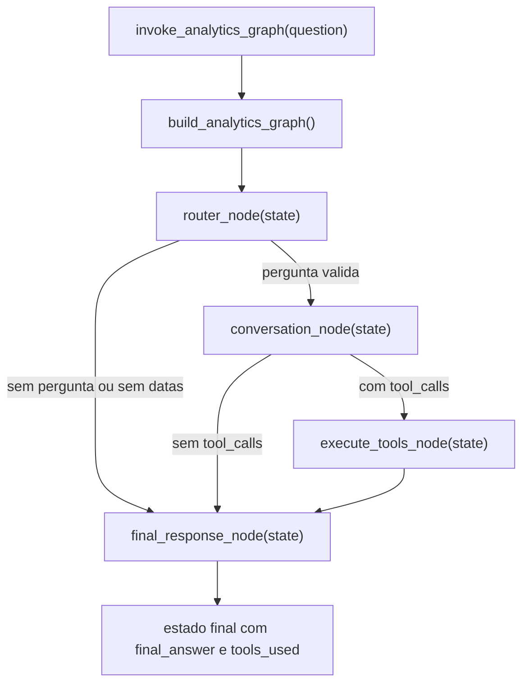

## Estrutura do arquivo

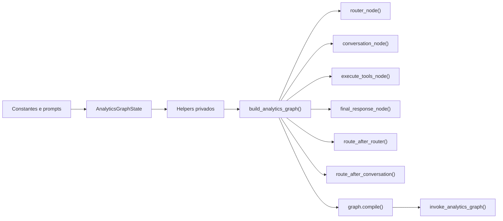

## 1. Constantes principais

Antes das funcoes, o arquivo define algumas constantes:

- `DATE_TOKEN_PATTERN`: regex que encontra datas no formato `YYYY-MM-DD`.
- `CONVERSATION_SYSTEM_PROMPT`: prompt do LLM que decide se deve responder direto ou chamar tools.
- `FINAL_RESPONSE_SYSTEM_PROMPT`: prompt do LLM que transforma o resultado tecnico das tools em linguagem de negocio.
- `MISSING_DATES_MESSAGE`: mensagem padrao para pedir clarificacao.
- `EMPTY_QUESTION_MESSAGE`: mensagem para pergunta vazia.
- `TEMPORARY_TOOL_FAILURE_MESSAGE`: mensagem de falha tratada quando a tool quebra.

Essas constantes existem para que a logica do grafo nao fique cheia de strings soltas.

## 2. `AnalyticsGraphState`

Definido em `workflow.py`, ele e o contrato de estado compartilhado entre os nos.

Campos:

- `question`: pergunta original recebida.
- `messages`: historico das mensagens do LangChain/LangGraph.
- `next_step`: pequeno marcador interno de roteamento.
- `final_answer`: resposta textual final.
- `tools_used`: lista das tools realmente usadas.

### Visualizando o estado

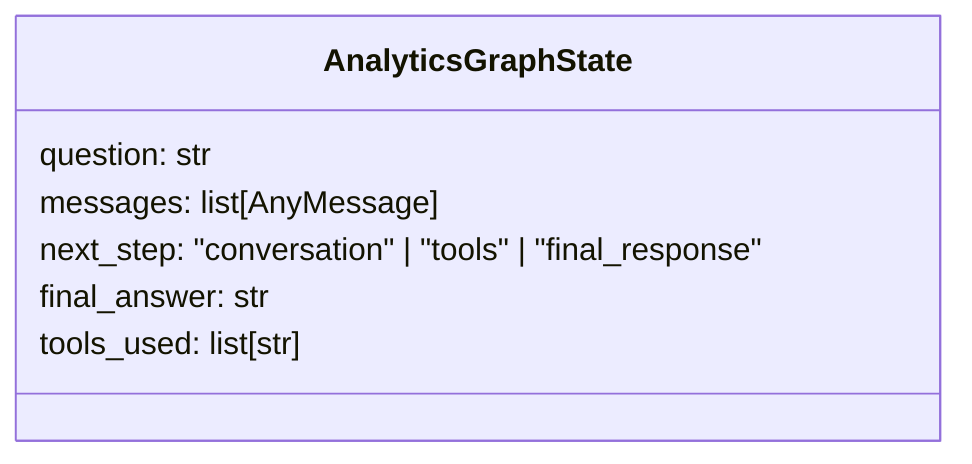

### O que `add_messages` faz

O campo `messages` usa `Annotated[..., add_messages]`.

Na pratica isso significa:

- quando um no retorna novas mensagens, o LangGraph faz append;
- ele nao substitui o historico inteiro por padrao.

Sem esse reducer, cada no poderia sobrescrever o historico anterior.

## 3. Funcoes helper

Essas funcoes nao sao nos do grafo. Elas ajudam os nos a trabalhar com o estado.

### 3.1 `_content_to_text(content)`

**Objetivo:** transformar qualquer formato de conteudo de mensagem em texto simples.

Ela trata tres casos:

1. Se ja for `str`, devolve diretamente.
2. Se for `list`, percorre item por item.
3. Se for qualquer outro tipo, faz `str(...)`.

Quando o item da lista for `dict`, ela tenta:

- primeiro pegar `item["text"]`;
- se nao existir, serializa o dict como JSON.

### Por que isso existe

No ecossistema LangChain, `message.content` nem sempre e uma string pura. Pode ser:

- string;
- lista de blocos;
- estruturas mistas.

Essa funcao evita espalhar essa normalizacao pelo resto do arquivo.

### Fluxo interno

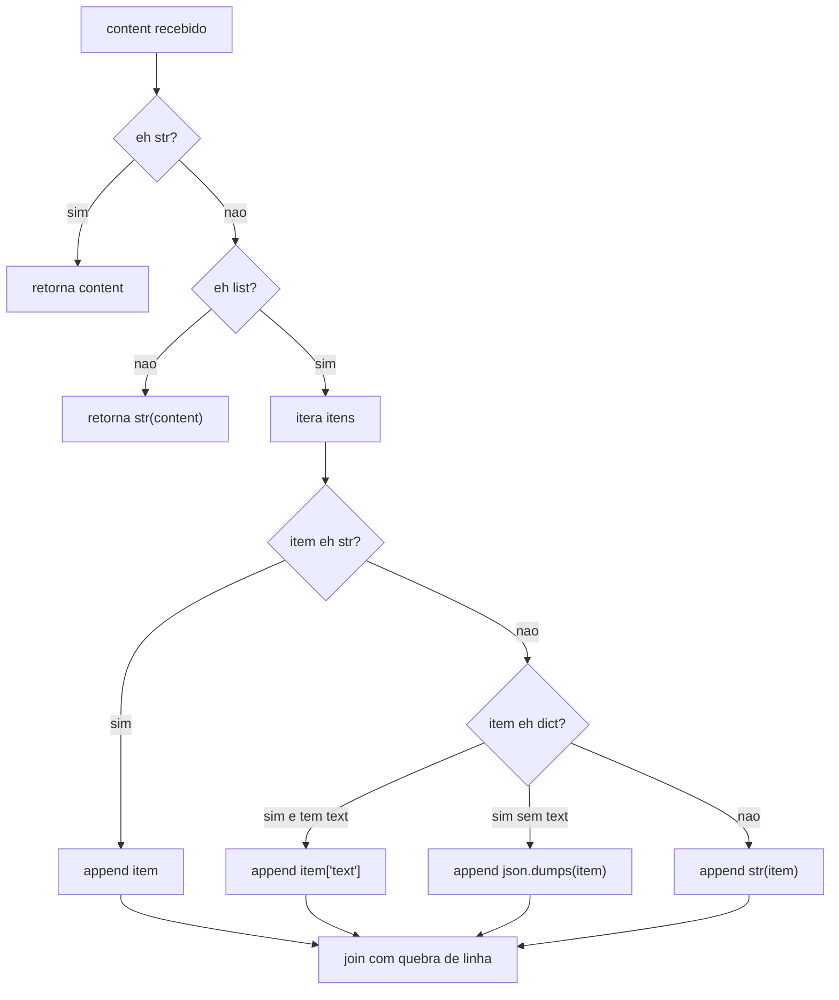

### 3.2 `_resolve_question(state)`

**Objetivo:** descobrir qual e a pergunta do usuario a partir do estado.

Ordem de prioridade:

1. Tenta `state["question"]`.
2. Se estiver vazia, procura a ultima `HumanMessage` em `state["messages"]`.
3. Se nada funcionar, retorna string vazia.

### Por que isso existe

O grafo pode ser chamado de formas diferentes:

- passando a pergunta diretamente no estado;
- ou reaproveitando um historico de mensagens.

Essa funcao centraliza a regra de leitura da pergunta.

### Fluxo interno

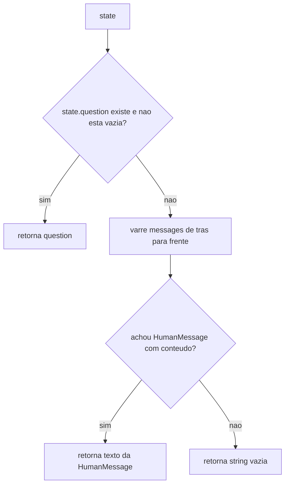

### 3.3 `_extract_iso_dates(question)`

**Objetivo:** extrair tokens de data no formato `YYYY-MM-DD`.

Ela usa a regex `DATE_TOKEN_PATTERN.findall(question)`.

### Importante

Ela **nao valida semanticamente** a data. Exemplo:

- `2024-01-31` bate na regex e parece ok.
- `2024-99-99` tambem bate na regex, mesmo sendo uma data invalida.

Neste arquivo ela serve apenas como guarda rapida para saber se o usuario informou ou nao duas datas.

### 3.4 `_get_last_ai_message(messages)`

**Objetivo:** encontrar a ultima mensagem produzida pelo modelo.

Ela percorre `messages` de tras para frente e devolve o primeiro item que for `AIMessage`.

### Por que isso existe

Depois da conversa com o LLM, o sistema precisa responder perguntas como:

- o modelo pediu tool?
- o modelo respondeu diretamente?
- qual foi a ultima fala da IA?

Essa funcao evita repetir a mesma varredura em varios pontos.

### 3.5 `_collect_tool_messages(messages)`

**Objetivo:** pegar somente as `ToolMessage`.

Ela faz um filtro simples:

- se a mensagem for `ToolMessage`, entra;
- se nao for, fica fora.

### Uso principal

Ela e usada no `final_response_node()` para descobrir se houve execucao de tools e para montar o contexto que sera sintetizado.

### 3.6 `_collect_tools_used(messages)`

**Objetivo:** produzir a lista de nomes das tools usadas, sem repeticao.

Passos:

1. Percorre `messages`.
2. Ignora tudo que nao for `ToolMessage`.
3. Ignora mensagens sem `name`.
4. Usa um `set` chamado `seen` para evitar duplicatas.
5. Monta a lista final `tools_used`.

### Exemplo

Se o historico tiver:

- `ToolMessage(name="traffic_volume_analyzer")`
- `ToolMessage(name="traffic_volume_analyzer")`
- `ToolMessage(name="channel_performance_analyzer")`

O retorno sera:

```text
["traffic_volume_analyzer", "channel_performance_analyzer"]
```

### 3.7 `_serialize_tool_result(result)`

**Objetivo:** transformar o resultado Python da tool em JSON formatado.

Ela usa:

```python
json.dumps(result, ensure_ascii=False, indent=2, default=str)
```

### Por que isso existe

O `ToolMessage` precisa carregar um conteudo que seja facil de:

- armazenar no historico;
- inspecionar;
- enviar depois para o LLM sintetizador.

## 4. `build_analytics_graph(...)`

Essa e a funcao central do arquivo.

Assinatura:

```python
def build_analytics_graph(
    settings: Settings | None = None,
    *,
    tool_enabled_llm: Any | None = None,
    response_llm: Any | None = None,
    tools: tuple[BaseTool, ...] | None = None,
) -> Any:
```

## O que ela recebe

- `settings`: configuracoes da aplicacao, usadas para construir os LLMs reais.
- `tool_enabled_llm`: opcional. Permite injetar um LLM ja preparado com `bind_tools()`.
- `response_llm`: opcional. Permite injetar um LLM para sintese final.
- `tools`: opcional. Permite trocar as tools reais por doubles/stubs em testes.

## O que ela monta no inicio

### `analytics_tools`

Se o caller nao passou tools, usa `get_analytics_tools()`.

### `tools_by_name`

Transforma a tupla de tools em um dicionario:

```python
{
    "traffic_volume_analyzer": <tool>,
    "channel_performance_analyzer": <tool>,
}
```

Isso existe porque o `tool_call` do LLM chega pelo nome.

### `conversation_llm`

Se o caller nao injetou um LLM, ele usa `build_tool_enabled_llm(settings)`.

Esse e o LLM que:

- recebe a pergunta;
- pode gerar `tool_calls`.

### `synthesis_llm`

Se o caller nao injetou um LLM, ele usa `build_analytics_llm(settings)`.

Esse e o LLM que:

- nao precisa chamar tools;
- apenas transforma o resultado em resposta natural.

## Por que os nos ficam dentro dessa funcao

As funcoes `router_node`, `conversation_node`, `execute_tools_node`, `final_response_node`, `route_after_router` e `route_after_conversation` sao definidas dentro de `build_analytics_graph()` porque elas dependem do contexto montado ali:

- `tools_by_name`
- `conversation_llm`
- `synthesis_llm`

Em outras palavras, elas fecham sobre esse contexto.

## 5. Nos internos do grafo

### 5.1 `router_node(state)`

Esse e o primeiro no do grafo.

### Responsabilidade

Fazer uma validacao inicial bem barata, antes de gastar LLM ou tool.

### Logica

1. Usa `_resolve_question(state)` para descobrir a pergunta.
2. Se nao houver pergunta:
   - define `final_answer = EMPTY_QUESTION_MESSAGE`
   - define `next_step = "final_response"`
3. Se houver menos de duas datas:
   - define `final_answer = MISSING_DATES_MESSAGE`
   - define `next_step = "final_response"`
4. Se estiver tudo ok:
   - define `next_step = "conversation"`

### Intuicao

Esse no funciona como um guard clause ou middleware de entrada.

### Visual

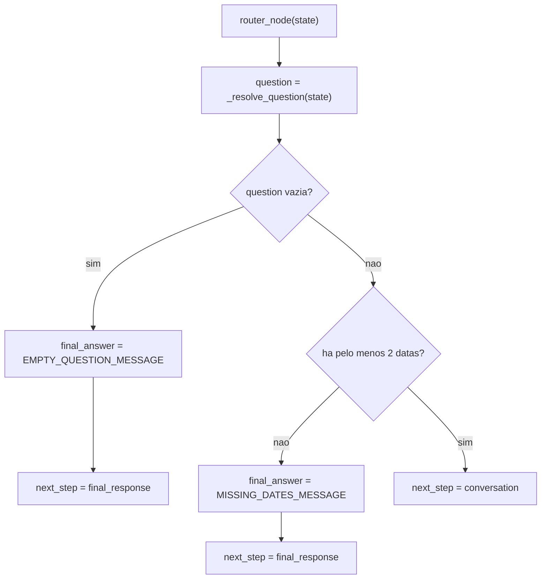

### 5.2 `conversation_node(state)`

Esse e o no que chama o LLM com tool binding.

### Responsabilidade

Produzir a proxima resposta da IA, que pode ser:

- uma resposta textual direta;
- uma resposta com `tool_calls`.

### Logica

1. Resolve a pergunta com `_resolve_question(state)`.
2. Copia `state["messages"]`.
3. Se o historico estiver vazio:
   - injeta uma `HumanMessage` com a pergunta.
4. Chama `conversation_llm.invoke(...)` com:
   - `SystemMessage(CONVERSATION_SYSTEM_PROMPT)`
   - historico atual
5. Retorna as novas mensagens para append no estado.

### Por que ela injeta `HumanMessage`

O grafo pode ser chamado apenas com `{"question": ...}` e sem historico. O LLM, no entanto, espera mensagens. Entao esse no cria a mensagem humana inicial quando necessario.

### Visual

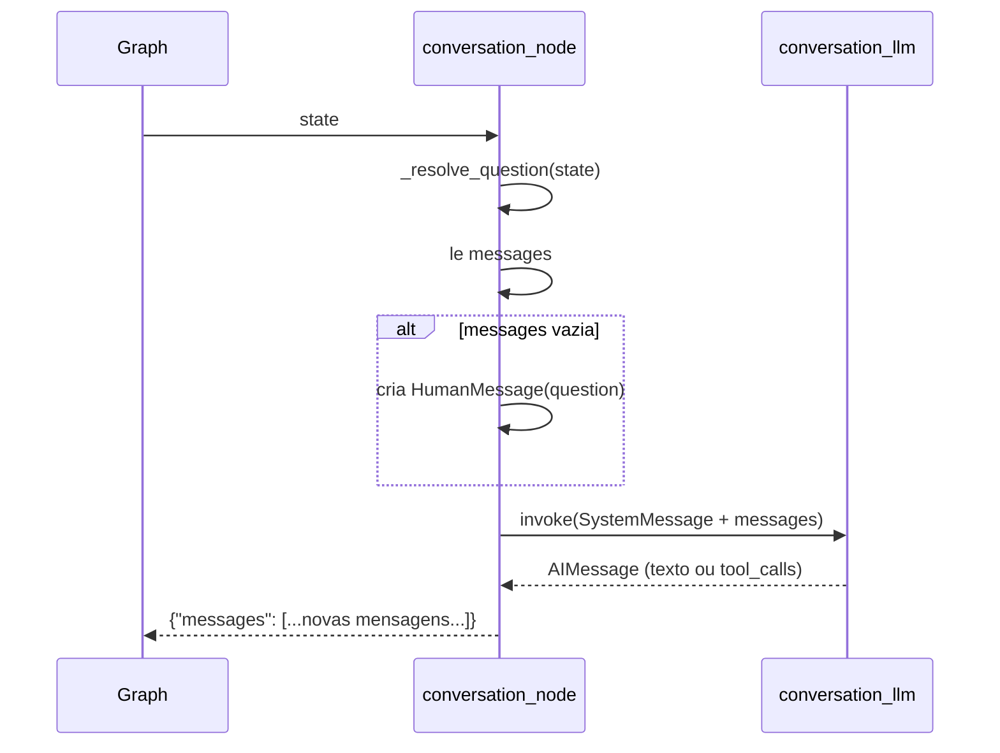

### 5.3 `execute_tools_node(state)`

Esse no executa as tools pedidas pelo modelo.

### Responsabilidade

Transformar `tool_calls` do LLM em chamadas reais de funcoes Python.

### Logica

1. Le as mensagens do estado.
2. Pega a ultima `AIMessage`.
3. Se nao houver `AIMessage` ou nao houver `tool_calls`, retorna `{}`.
4. Para cada `tool_call`:
   - extrai `tool_name`;
   - extrai `tool_call_id`;
   - procura a tool em `tools_by_name`.
5. Se a tool nao existir:
   - cria um `ToolMessage` com `status="error"`.
6. Se a tool existir:
   - chama `tool.invoke(tool_call)`;
   - serializa o resultado com `_serialize_tool_result(result)`;
   - cria um `ToolMessage` com `artifact=result`.
7. Se houver excecao:
   - cria um `ToolMessage` de erro.
8. Retorna `{"messages": tool_messages}`.

### Por que ele usa `ToolMessage`

Porque no modelo mental do LangChain/LangGraph, o retorno de uma tool entra no historico como uma mensagem especial. Depois o sintetizador pode ler isso como parte do contexto.

### Visual

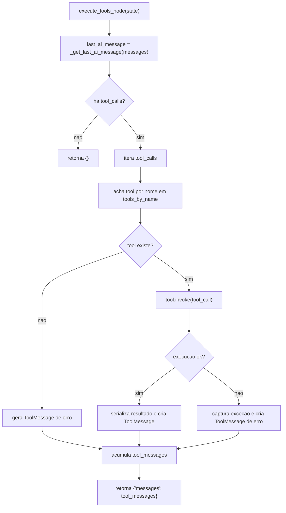

### 5.4 `final_response_node(state)`

Esse e o no que fecha o fluxo.

### Responsabilidade

Decidir qual resposta final o sistema deve devolver.

### Ele cobre quatro cenarios

#### Cenario A: ja existe `final_answer` e nao houve tool

Isso acontece, por exemplo, quando:

- a pergunta veio vazia;
- faltaram datas.

Nesse caso ele so reaproveita o que o `router_node()` ja decidiu.

#### Cenario B: alguma tool falhou

Se qualquer `ToolMessage` tiver `status == "error"`, ele devolve:

- `TEMPORARY_TOOL_FAILURE_MESSAGE`

Aqui a prioridade e robustez e mensagem tratada.

#### Cenario C: houve resultado de tool

Esse e o caso principal.

Passos:

1. Resolve a pergunta original.
2. Monta `tool_context` concatenando os resultados das `ToolMessage`.
3. Chama `synthesis_llm.invoke(...)` com:
   - `FINAL_RESPONSE_SYSTEM_PROMPT`
   - uma `HumanMessage` contendo:
     - a pergunta original
     - os resultados estruturados
4. Guarda a nova `AIMessage`.
5. Preenche:
   - `final_answer`
   - `tools_used`

#### Cenario D: nao houve tool e tambem nao havia `preset_answer`

Nesse caso ele tenta usar a ultima `AIMessage` como resposta final direta. Isso cobre, por exemplo, respostas como:

- recusa de escopo;
- resposta textual sem necessidade de consulta.

### Visual

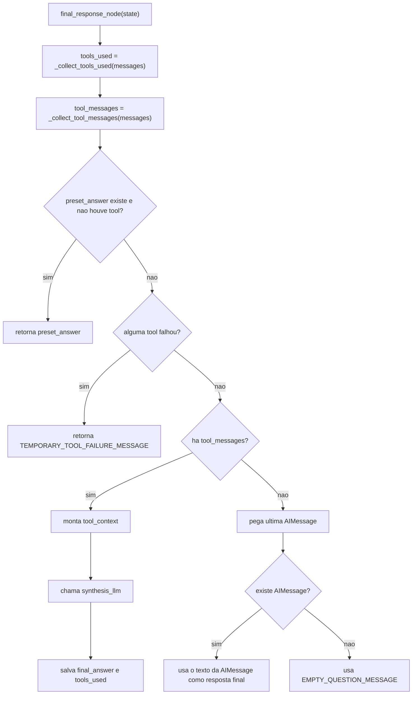

## 6. Funcoes de roteamento

Essas funcoes nao fazem trabalho de negocio. Elas apenas ajudam o LangGraph a escolher a proxima aresta.

### 6.1 `route_after_router(state)`

Le `state["next_step"]` e devolve:

- `"conversation"`
- ou `"final_response"`

Ela existe porque o `router_node()` nao muda a estrutura do grafo; ele apenas escreve no estado qual deve ser o proximo passo.

### 6.2 `route_after_conversation(state)`

Olha a ultima `AIMessage` e decide:

- se houver `tool_calls`, retorna `"tools"`;
- caso contrario, retorna `"final_response"`.

### Visual dos dois roteadores

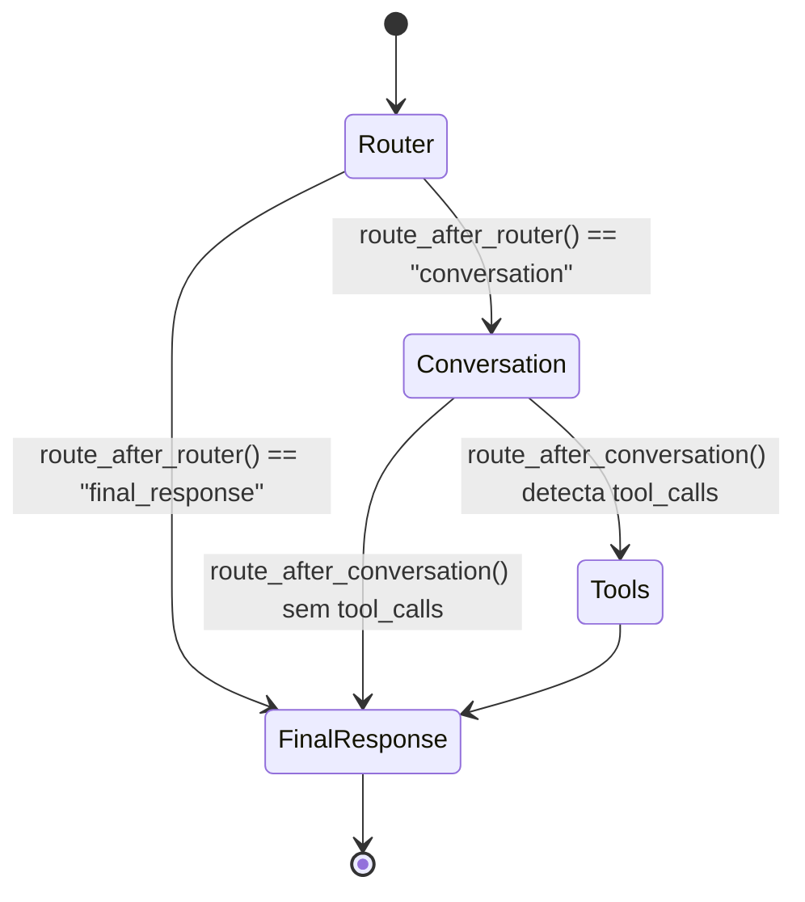

## 7. Montagem do grafo

Ainda dentro de `build_analytics_graph()`:

1. Cria `graph = StateGraph(AnalyticsGraphState)`.
2. Registra os nos:
   - `router`
   - `conversation`
   - `tools`
   - `final_response`
3. Registra as arestas:
   - `START -> router`
   - `router -> conversation | final_response`
   - `conversation -> tools | final_response`
   - `tools -> final_response`
   - `final_response -> END`
4. Chama `graph.compile()`.

### Visual completo do grafo

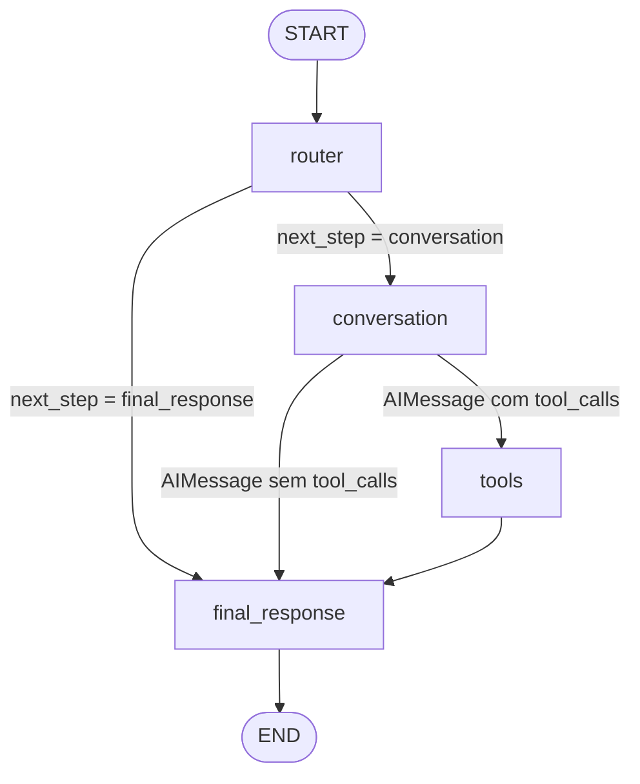

## 8. `invoke_analytics_graph(question, settings=None)`

Essa e a funcao publica mais simples do arquivo.

### Responsabilidade

Permitir que outro modulo faca:

```python
result = invoke_analytics_graph("Qual foi o volume de Search entre 2024-01-01 e 2024-01-31?")
```

sem precisar saber como o `StateGraph` e montado internamente.

### Passos

1. Chama `build_analytics_graph(settings)`.
2. Executa `graph.invoke({"question": question})`.
3. Faz cast para `AnalyticsGraphState`.
4. Retorna o estado final.

### Em termos de arquitetura

Se `build_analytics_graph()` e o "composition root" do arquivo, `invoke_analytics_graph()` e a fachada simples para consumo externo.

## 9. Exemplo ponta a ponta

Pergunta:

```text
Qual foi o volume de usuarios de Search entre 2024-01-01 e 2024-01-31?
```

### Caminho esperado

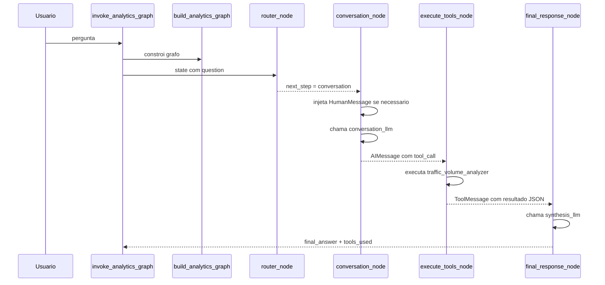

### Caminho quando faltam datas

Pergunta:

```text
Qual canal teve mais usuarios?
```

Fluxo:

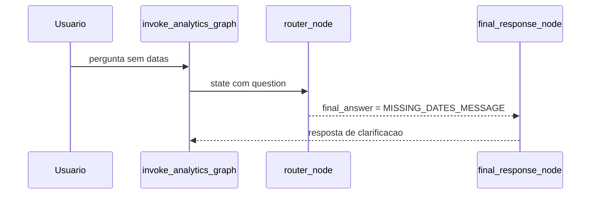

## 10. Resumo final por funcao

| Funcao | Papel |
|---|---|
| `_content_to_text` | Normaliza conteudo de mensagem para string |
| `_resolve_question` | Descobre a pergunta a partir do estado |
| `_extract_iso_dates` | Encontra datas no formato ISO por regex |
| `_get_last_ai_message` | Pega a ultima resposta do modelo |
| `_collect_tool_messages` | Filtra mensagens de tool |
| `_collect_tools_used` | Lista nomes de tools usadas sem duplicar |
| `_serialize_tool_result` | Transforma retorno da tool em JSON |
| `build_analytics_graph` | Monta e compila o `StateGraph` |
| `router_node` | Faz validacao inicial e decide se continua |
| `conversation_node` | Chama o LLM que pode gerar `tool_calls` |
| `execute_tools_node` | Executa as tools pedidas pela IA |
| `final_response_node` | Fecha o fluxo e monta a resposta final |
| `route_after_router` | Decide a aresta depois do router |
| `route_after_conversation` | Decide se vai para tools ou resposta final |
| `invoke_analytics_graph` | Fachada simples para executar o grafo |

## 11. Leitura em linguagem simples

Se eu resumisse o arquivo em uma frase:

> Ele recebe uma pergunta, verifica se da para prosseguir, deixa a IA decidir se precisa consultar dados, executa a consulta quando necessario e transforma o resultado em uma resposta de negocio.

Se eu resumisse em quatro frases:

1. Primeiro ele barra perguntas vazias ou sem datas.
2. Depois ele pergunta ao LLM se precisa chamar alguma tool.
3. Se precisar, executa a tool real e guarda o resultado no historico.
4. Por fim, usa outro LLM para transformar o resultado tecnico em resposta final legivel.

